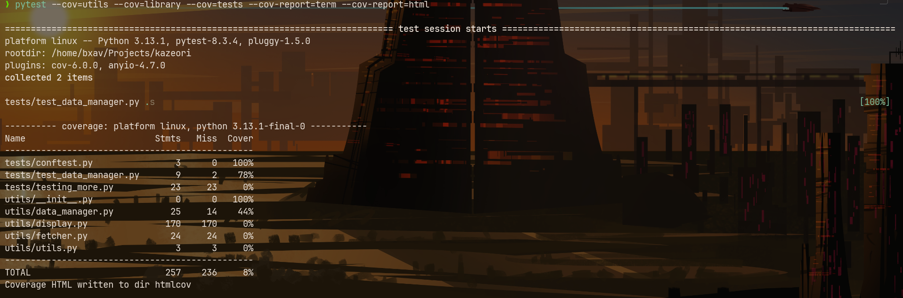

# **Verse Vault**

A private library for storing and exploring a collection of short texts, poems, apophthegms, and other literary pieces. The program provides a simple and interactive way to browse, fetch, and manage a library of texts.

*By Bernardo Fernandes*

---

## **Table of Contents**

- [Project Checklist](#project-checklist)
- [Development Tools](#development-tools)
- [Demo](#demo)
- [Exemplary Screenshots](#exemplary-screenshots)
- [Current Status](#current-status)
- [Project Structure](#project-structure)
- [Features](#features)
- [Installation and Usage](#installation-and-usage)
- [Customization Guide](#customization-guide)
- [Acknowledgments](#acknowledgments)

---

## Project Checklist

### 1. Use and Understand Git

- All project updates are tracked and committed using Git.

| **Command**               | **Used to...** |
|---------------------------|---------------|
| `git init`               | Start version control for the project. |
| `git add .`              | Stage changes before making a commit. |
| `git commit -m "description"`    | Commit the staged changes with a description. |
| `git push origin master`   | Push committed changes to the remote repository. |
| `git pull origin master`   | Fetch and merge the latest updates from the remote repository. |

For reference, these commands have been applied in multiple commits across the project:  

🔗 **[GitHub Commit History](https://github.com/bxavaby/vault/commits/master)**

---

### 2. UML Diagrams

To document the architecture and behavior of *Verse Vault*, I have created the following **diagrams**:

#### 1️⃣ Use-Case Diagram
The **Use-Case Diagram** visualizes how users interact with the system, showcasing different features available in the CLI.

📌


- The **User** interacts with the CLI interface.
- The user can perform actions such as:
  - **Browsing** the library of texts.
  - **Fetching** a random entry.
  - **Searching** for specific texts by title or author.
  - **Adding** new texts to the collection.
  - **Favoriting** entries for later access.


#### 2️⃣ Component Diagram
The **Component Diagram** represents the structural organization of the program, showing how different components communicate.

📌


- The **CLI Interface** serves as the user’s access point.
- The **Library (JSON Storage)** holds text data.
- **Utility Functions** provide helper methods for various operations.
- **Display Manager** formats terminal output for readability.
- **Data Manager** handles reading and writing to the storage.


#### 3️⃣ Activity Diagram
The **Activity Diagram** illustrates the sequence of actions when a user fetches an entry.

📌 


- The process starts with the user selecting the *Browse your vault* option from the menu, followed by the category *Authors* or *Genres*.
- The user decides between:
  - **Fetching a random entry**.
  - **Searching for a specific entry, by listing them all**.
- The system retrieves the selected text and **displays it**.
- The process ends when the entry is shown and the user hits **ENTER**.

---

### 3. Requirements

#### Currently:


- [Link to Workspace](https://trello.com/invite/b/678fed2adab3041ec224dd07/ATTI4a251d1916f5f228df66c26d746aff325DBA7BE5/verse-vault)


---

### 4. Analysis

- Problem Definition
- Target Audience
- Unique Selling Proposition (USP)
- Competitor Analysis
- Core Features
- Monetization Strategy
- Technical Feasibility
- User Experience (UX) Design
- Data Privacy and Security
- Scalability
- Market Validation
- Development Timeline
- Risks and Challenges
- Innovation Potential
- Future Expansion

[The Detailed Version](media/analysis.pdf)

---

### 5. Domain-Driven Design

#### 🔎 **A) Event-Storming: Discovering Domains**
To define the functional areas of **Verse Vault**, I conducted **Event-Storming**, ensuring the project remains modular and extensible. The primary objective of this tool is to **help users store, explore, and manage a literary collection interactively**.

#### 📖 **Identified Domains**

| **Domain**                     | **Description**                                         | **Type** |
|---------------------------------|---------------------------------------------------------|----------|
| **Vault & Content Management**  | Stores and organizes short texts, poems, and quotes   | **Core** |
| **Discovery & Retrieval**       | Allows users to search, fetch, and randomize entries  | **Core** |
| **User Customization**          | Enables users to modify the database, add/edit texts  | Supporting |
| **Styling & Display**           | Formats terminal output for readability               | Supporting |
| **CLI & Interactive Commands**  | Handles user interactions via command-line interface  | **Core** |
| **Favorites & Personalization** | Lets users mark preferred texts for quick access     | Supporting |


#### 📌 **B) Core Domain Chart**
Based on an event-storming process, the [chart](media/core_domain_chart.odg) found in [media](media/) highlights **core** domains.

- **CLI & Interactive Input** serves as the main user interface.
- **Vault & Management** handles text storage and retrieval.
- **Discovery & Fetch** helps users explore the content.
- **Styling & Display** ensure readable output.
- **Personalization & Customization** enhance the user experience.

---

### 6. Metrics

To ensure **high performance, maintainability, and code quality**, Verse Vault was analyzed using **Flake8 and additional metrics**.

#### 1️⃣ **Flake8 Code Quality Metrics**
I ran a **Flake8 analysis**, focusing on:
- **Unused Imports** (`F401`): Identifies unnecessary imports that can be removed to optimize performance.
- **Trailing Whitespace & Blank Lines** (`W291`, `W293`, `W391`): Minor stylistic issues that were cleaned up.
- **Indentation Issues** (`E111`, `E117`): Ensured all indentation is consistent and follows PEP-8 guidelines.
- **Blank Line Formatting** (`E302`, `E305`, `E303`): Adjusted blank lines for readability and structure.

📌 **Flake8 Report Before Fixes**:  
  

📌 **Flake8 Report After Fixes**:  
  

#### 2️⃣ **Testing with Pytest**
Pytest focused on:
- `--cov=utils` → Measures coverage for **utility functions**.  
- `--cov=library` → Measures coverage for **JSON-based text storage**.  
- `--cov-report=term` → Displays **coverage summary** in the terminal.  
- `--cov-report=html` → Generates an **HTML report** with detailed results.  

📌 **Pytest Report**:  
  

*Still a long way from the 80% goal, but the tested sections are most vital.*

#### 📝 **Findings**:
- **Removed unused imports**, to improve clarity.
- **Fixed all whitespace and indentation errors**, to ensure a clean structure.

---

### 7. Clean Code Development (CCD)

### **A) 5 Points of Clean Code in Verse Vault**
Here are five improvements made to the project that contribute to **clean code principles**:

#### 1️⃣ Meaningful Function & Variable Names  

Instead of generic names like `data_func()`, the project uses **clear, self-explanatory names** like:

```python
def load_library(text_type):
    """Load a JSON library file based on text type."""
```

**Why?**  

- Increases readability.  
- Makes the code self-documenting.  
- Reduces the need for unnecessary comments.  

#### 2️⃣ Modular Structure (Separation of Concerns)  

The codebase follows **Single Responsibility Principle (SRP)** by splitting functionalities into separate modules:  

- `display.py` → Handles UI and formatting.  
- `fetcher.py` → Manages data retrieval.  
- `data_manager.py` → Loads and saves JSON data.  

**Why?**  

- Easier maintenance.  
- Better scalability.  
- Clearer structure, making debugging more efficient.  

#### 3️⃣ Consistent Formatting & PEP-8 Compliance  

Code is formatted using **Flake8** to enforce consistent indentation, spacing, and line length.  

**Example:**  

```python
def display_menu():
    menu_items = [
        "1. Browse your vault",
        "2. Random poem",
        "3. Random excerpt",
        "4. Fill up your vault!",
        "5. Show favourites <3",
        "6. Exit..."
    ]
    menu_items.sort()
```

**Why?**  

- Ensures clean, easy-to-read, and maintainable code. 
- Avoids style inconsistencies in the project.  

#### 4️⃣ Error Handling & Exception Safety

Functions gracefully handle missing files instead of crashing.  

**Example:**  

```python
def load_library(text_type):
    if text_type not in file_map:
        raise ValueError(f"Invalid text type '{text_type}' provided.")
```

**Why?**  

- Prevents unexpected crashes. 
- Ensures the program handles errors smoothly.
- Improves user experience.

#### 5️⃣ Test Coverage for Key Functions  

Implemented **pytest** tests to ensure functions work as expected.  
Used **mock tests & coverage tracking** to verify code execution.  

**Example:**  

```python
def test_load_library():
    data = load_library("Poem")
    assert isinstance(data, list)  # Ensures it returns a list
```

**Why?**  

- Reduces the risk of bugs. 
- Ensures that core functions are working.
- Helps achieve higher test coverage.

### 📄 B) Clean Code Cheat Sheet  

For a more detailed reference on Clean Code principles, check out the **PDF cheat sheet**:  

📥 **[Clean Code Cheat Sheet](media/cleancode.pdf)**  

---

#### 8. Refractoring

This section demonstrates two refactoring examples taken from the [refractoring.py](se-tasks/refractoring.py) script.

Each refactoring includes:  
✔ The **original code**.  
✔ The **refactored version**.  
✔ An **explanation of improvements**.

#### **1️⃣ Currency Conversion**
🔴 **Original Code**
```python
def convert_to_euro(amount_in_dollars):
    dollar_to_euro_rate = 0.85
    return amount_in_dollars * dollar_to_euro_rate

def demo_refact(money_net): 
    tax_rate = 0.3
    money_after_tax = money_net * (1 - tax_rate)

    money_in_euro = convert_to_euro(money_after_tax)

    return money_in_euro

net_income = 1
money_in_euro = demo_refact(net_income)
print(f"\nMoney in $ before tax: {net_income}")
print(f"\nMoney in Euro after tax: {money_in_euro:.2f}")
```

✅ **Refactored Code**
```python
def convert_currency(amount, rate=0.85):
    return amount * rate

def apply_tax(income, tax_rate=0.3):
    return income * (1 - tax_rate)

def process_conversion(money_net, tax_rate=0.3, conversion_rate=0.85):
    net_after_tax = apply_tax(money_net, tax_rate)
    money_in_euro = convert_currency(net_after_tax, conversion_rate)
    return money_in_euro

net_income = 1
money_in_euro = process_conversion(net_income)

print(f"\nMoney in $ before tax: {net_income}")
print(f"\nMoney in Euro after tax: {money_in_euro:.2f}")
```

### What Changed & Why?
#### ✅ Encapsulated logic into reusable functions:
- ```convert_currency()``` allows for dynamic currency conversions.
- ```apply_tax()``` separates the tax logic from the conversion.
- ```process_conversion()``` applies both tax and currency conversion in one step.
#### ✅ Improved Readability & Maintainability:
- Functions now have clear responsibilities.
- Easier to update tax rates or conversion rates if needed.
#### ✅ Increased Code Reusability:
- This approach supports multiple currencies and different tax rates in the future.

#### **2️⃣ Print Statements & Logging**
🔴 **Original Code**
```python
print(f"\nMoney in $ before tax: {net_income}")
print(f"\nMoney in Euro after tax: {money_in_euro:.2f}")
```

✅ **Refactored Code**
```python
import logging

logging.basicConfig(level=logging.INFO, format="%(message)s")

def display_conversion_results(original, converted, currency="EUR"):
    logging.info(f"\nMoney before tax: ${original:.2f}")
    logging.info(f"Money after tax in {currency}: €{converted:.2f}")

net_income = 1
money_in_euro = process_conversion(net_income)

display_conversion_results(net_income, money_in_euro)
```

### What Changed & Why?
#### ✅ Replaced print statements with *logging*:
- Logs are structured and easier to debug.
- Can be redirected to log files or debugging tools.
#### ✅ Encapsulated display logic into a function:
- ```display_conversion_results()``` allows formatted logging.
- Easier to modify later for different currencies.
#### ✅ Professional Output Formatting:
- Allows for cleaner logs and better readability.

---

#### 9. Build Management

Verse Vault integrates a **Makefile-based build system** and **Sphinx for documentation** to automate testing and generate documentation.

### 🛠 **Using the Makefile**
A [`Makefile`](verse-vault/Makefile) is used to automate project tasks such as installing dependencies, running tests, generating code coverage, and building documentation.


### **Available Makefile Commands**
Run these commands from the **project root directory**:

| Command           | Description |
|------------------|-------------|
| `make lint`      | Run Flake8 linting to check for style errors. |
| `make test`      | Run all tests with `pytest`. |
| `make coverage`  | Generate a test coverage report. |
| `make docs`      | Build project documentation using **Sphinx**. |
| `make clean`     | Remove temporary files and caches. |

### **Usage**
```bash
# Install all dependencies
make install

# Run tests
make test

# Generate test coverage report
make coverage

# Build Sphinx documentation
make docs
```

### 🛠 **Sphinx for Documentation**
The [documentation](verse-vault/docs/build/html/index.html) was generated by Sphinx, which is a powerful tool for automating and managing documentation.
What you will find in index.html:


### **Building**
After running ```make docs```, the HTML documentation is available in:

```bash
docs/build/html/index.html
```

### **To open it:**

```bash
xdg-open docs/build/html/index.html  # Linux
open docs/build/html/index.html      # macOS
start docs/build/html/index.html     # Windows
```

---

#### 10. Continuous Delivery

---

#### 11. Unit Tests

---

#### 12. IDE
Before I provide a list of all the code editors/IDE's + favourite shortcuts I have used while working on *Verse Vault*, I must clarify that **Micro** was my top pick most of the times, **VS Code** was used only when I felt the need to use **Copilot**, which I talk about in the next task, and as for **Neovim**, it was sort of experimental, but a great learning experience.

- **Code Editors**:

  - **Micro**:
    - `Ctrl+S` → Save file
    - `Ctrl+Q` → Quit editor
    - `Ctrl+E` → Command mode
  - **Neovim**:
    - `:w` → Save file
    - `:q` → Quit editor
    - `dd` → Delete line
    - `Shift + :` → Command mode
  - **VS Code**:
    - `Ctrl+F` → Find text
    - `Ctrl+Shift+P` → Command Palette
    - `Alt+Shift+F` → Format document

---

### 13. AI Coding

- **AI Integration**:
  - Copilot was set up inside VS Code for prompt code assistance and debugging. I had already configured it through GitHub, by connecting it to VS Code and installing the plug-in.
  - [Fabric Framework](https://github.com/danielmiessler/fabric):  
      Used it for its sleek and simple solution to leverage LLMs directly from the command line, enhancing workflow efficiency and allowing for swift experimentation.

---

### 14. Functional Programming

---

## **Demo**
  
*Above: A brief walkthrough of the core features.*

---

## **Exemplary Screenshots**

### **Add Entry Menu**
  
*Above: Sub-menu with types of entry.*

### **Browsing**
  
*Above: Sub-menu with types of search.*

### **Favourites List**
  
*Above: List of preferred titles.*

---

## **Current Status**
### December 2, 2024:
- Basic functionality is implemented, including:
  - Text browsing and randomization features.
  - Modular utilities for managing data, display, and fetching.
  
- The database is structured using JSON files stored in the `library/` directory.

- Git is used for version control with the following commands:
  - `git init`, `git clone`, `git add`, `git commit`, `git push`, `git pull`, `git status`, `git log`.

- PyCache files have been ignored using `.gitignore`.

---

## **Project Structure**
```plaintext
.
├── README.md
└── verse-vault
    ├── assets
    │   └── logo.txt
    ├── library
    │   ├── apophthegm.json     # apophthegms
    │   ├── other_texts.json    # miscellaneous
    │   ├── poems.json          # poems
    │   └── short_stories.json  # short stories
    ├── main.py                 # entry point
    ├── requirements.txt        # dependencies
    └── utils
        ├── data_manager.py     # handles loading and saving JSON files
        ├── display.py          # handles terminal display and styling
        ├── fetcher.py          # internal fetcher
        └── __init__.py         # module initializer
```

---

## **Features**
- **Browse**: Navigate through your library by category (poems, apophthegms, short stories, others, favorited).
- **Fetch**: Fetch random entries or search by author/genre/title.
- **Customizable**: Easily add new texts or modify the existing content.
- **Minimalist Design**: Simple and clean display focused on readability.

---

## **Installation and Usage**

#### **Prerequisites**
- Python 3.8 or later
- Virtual environment (recommended)

#### **Steps to Run**
1. **Clone the Repository**:

   ```bash
   git clone https://github.com/bxavaby/verse-vault.git
   cd verse-vault
   ```
   
2. **Install Dependencies**:

   ```bash
   pip install -r requirements.txt
   ```
   
3. **Run the Program**:

   ```bash
   python main.py
   ```
   
---

## **Customization Guide**

### **1. Update the Logo**
Personalize the ASCII art logo displayed on startup.

- **Create Your Logo**:
  Use [Text to ASCII](https://patorjk.com/software/taag/) to create a custom logo.
- **Replace the Logo File**:
  Update the `logo.txt` in the `assets/` directory.
- **Preview**:
  Run the program to see your new logo.

### **2. Add New Categories**
Tweak your library by:

- **Deleting unwanted entries (manually)** in the `library/` directory >> select the JSON file >> delete any or all entries manually.
- **Adding new enties (manually)** in the `library/` directory >> select the JSON file >> add new entries manually.
- **Adding new entries (automatically)** run the program >> select option 4 ("Fill up your vault!") >> add the content interactively >> the program appends the new entry to the selected JSON automatically.

### **3. Change Display Colors**

- **Customizing the terminal colors** modify the COLOR_SCHEMES across all files using them (not optimal, will update in the future).

### **4. Customize Favorites**

- **Picking your preferred titles (manually)** in the `library/` directory >> select the JSON file >> edit the value directly (yes/no).
- **Picking your preferred titles (automatically)** when adding a new entry (option 4), the program requests a boolean value (yes/no).

---

## **Acknowledgments**
This project is inspired by a deep appreciation for literature, philosophy and the desire to create a personal, private library of short-form texts.


[](https://www.python.org/downloads/)
[](LICENSE)
[](#)
[](CONTRIBUTING.md)
[](https://github.com/bxavaby/vault/issues)
[](https://github.com/bxavaby/vault/network)
[](https://github.com/bxavaby/vault/stargazers)
